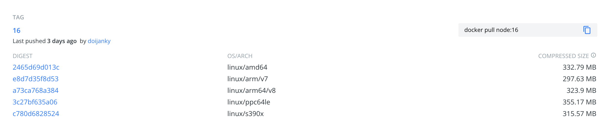

# Rudder Stack NodeJS Multi-Architecture

## Background

This is an example project for implementing a NodeJS application using Docker Image with a multi-architecture platform

There are 2 ways to generate multi-architecture platform image, by using `docker buildx`, or `docker mainfest`

### Docker Buildx
Buildx is designed to work well for building for multiple platforms and not only for the architecture and operating system that the user invoking the build happens to run.

Example command:
```
docker buildx build -f Dockerfile-buildx -t crossx/nodejs:latest \
    --platform linux/amd64,linux/arm64/v8 \
    --push .
```

Above example will build a docker image for architecture `linux/amd64` and `linux/arm64/v8`, to build a multi-architecture image, make sure base image are supporting your specified architecture, for example, in [NodeJS official repository](https://hub.docker.com/_/node?tab=tags&page=1&ordering=last_updated) you can see this information:



As listed in above image, currently NodeJS base image supporting below architecture:
- linux/amd64
- linux/arm/v7
- linux/arm64/v8
- linux/ppc64le
- linux/s390x


### Docker Manifest
A manifest list is a list of image layers that is created by specifying one or more (ideally more than one) image names. It can then be used in the same way as an image name in docker pull and docker run commands, for example.

Ideally a manifest list is created from images that are identical in function for different os/arch combinations. For this reason, manifest lists are often referred to as “multi-arch images”. However, a user could create a manifest list that points to two images -- one for windows on amd64, and one for darwin on amd64.

Example dockerfile `Dockerfile-manifest`:
```
ARG ARCH=
FROM ${ARCH}/alpine:3.11

RUN apk add --update npm

WORKDIR /app
COPY ./src /app/

RUN npm install

EXPOSE 3000

CMD ["npm", "start"]
```

Example command:
```
# building amd64 image
docker build -f Dockerfile-manifest -t crossx/nodejs:manifest-amd64 --build-arg ARCH=amd64 .

# building x86 image
docker build -f Dockerfile-manifest -t crossx/nodejs:manifest-i386 --build-arg ARCH=i386 .

# creating manifest 
docker manifest create crossx/nodejs:latest crossx/nodejs:manifest-amd64 crossx/nodejs:manifest-i386
```

Above example will build a docker image for architecture `amd64` and `i386`, to build a multi-architecture image, docker hub has official architecture user that can be used as base image, here is some example:
- [https://hub.docker.com/u/amd64](https://hub.docker.com/u/amd64) for amd64
- [https://hub.docker.com/u/i386](https://hub.docker.com/u/i386) for i386
- [https://hub.docker.com/u/arm32v7](https://hub.docker.com/u/arm32v7) for arm32v7
- [https://hub.docker.com/u/arm64v8](https://hub.docker.com/u/arm64v8) for arm64v8

## Setup
This repository contains:
- A terraform code that supports AWS and GCP
- A simple NodeJS application `src`
- Scripts for `pre-build`, `on-build`, and `post-build`, those scripts are running inside the AWS/GCP build process
- Dockerfile for `buildx` and `manifest`
- Build configuration for AWS (buildspec.yml) and GCP (cloudbuild.yaml)

### Cloud Setup

#### Step 1: Setup Infrastructure

Create a file with name `terraform.tfvars`, here is the example for AWS cloud:
```
cloud_service_provider = "aws"
region                 = "ap-southeast-1"

github_credential_token     = "INSERT_YOUR_GITHUB_TOKEN_HERE"
github_credential_user_name = "aashari"
github_repository_url       = "https://github.com/aashari/crossx-nodejs.git"
```
here is the example for GCP cloud:
```
cloud_service_provider = "gcp"
gcp_project_name       = "ashari-tech-main"

github_credential_user_name = "aashari"
github_repository_url       = "https://github.com/aashari/crossx-nodejs.git"
```

Initialize and Apply terraform
```
terraform init
terraform plan
terraform apply
```

#### Step 2: Setup Build Configuration
Update `build.env` file, here is the example for building with `buildx`:
```
BUILD_METHOD=buildx
ARCHITECTURE_LIST=linux/amd64,linux/arm/v7,linux/arm64/v8,linux/ppc64le,linux/s390x
LATEST_IMAGE_TAG=latest
```

here is the example for building with `manifest`:
```
BUILD_METHOD=manifest
ARCHITECTURE_LIST=amd64,i386
LATEST_IMAGE_TAG=latest
```

#### Step 3 (optional): Setup Scripts
Currently we have multi stage build which are pre-build, on-build, and post-build:
- script-pre-build.sh
- script-on-build.sh
- script-post-build.sh

You can customize the script as you needed

#### Step 4: Start Build
You just need to run a `git commit` and `git push` to trigger the cloud build

### Local Setup

#### Buildx

##### Step 1: Initialize Buildx
Make sure you enable buildx plugin on your local machine, to verify the buildx, you can run below command:
```
docker buildx ls
```

If you haven't enable it yet you can run this command:
```
chmod +x script-pre-build.sh
./script-pre-build.sh
```
##### Step 2: Start Building
To build a multi-architecture image, make sure base image are supporting your specified architecture, [information here](#docker-buildx), example command:
```
docker buildx build -f Dockerfile-buildx -t crossx/nodejs:latest \
    --platform linux/amd64,linux/arm64/v8 .
```

##### Step 3: See the result
From the command in Step 2, we build 2 architectures `linux/amd64` and `linux/arm64/v8`, you may run this command to see the detail of the architecture:
```
docker buildx imagetools inspect crossx/nodejs:latest
```
Here is the result of the example command:
```
Name:      crossx/nodejs:latest
MediaType: application/vnd.docker.distribution.manifest.list.v2+json
Digest:    sha256:86e418575845d247afe1ec6cd768f513a5ef7d35fec05986973557df43f24b1c
           
Manifests: 
  Name:      crossx/nodejs:latest@sha256:fa65c61ff4b77adccfeadafb13f8b3b310dc26034a91aaa3458c875b4a917b0b
  MediaType: application/vnd.docker.distribution.manifest.v2+json
  Platform:  linux/amd64
             
  Name:      crossx/nodejs:latest@sha256:56daea1658d607bebcb0cac7a8eba9babf72f729c1455afe981ab31e33998ad9
  MediaType: application/vnd.docker.distribution.manifest.v2+json
  Platform:  linux/386
```

#### Manifest / Native Docker Build

##### Step 1: Build the Image Architecture
To build a multi-architecture image, docker hub has official architecture user that can be used as base image, in this example we will build `amd64` and `i386` docker image by using base image alpine:
- [https://hub.docker.com/r/amd64/alpine](https://hub.docker.com/r/amd64/alpine) for amd64
- [https://hub.docker.com/r/i386/alpine](https://hub.docker.com/r/i386/alpine) for i386

```
# start build amd64 base
docker build -f Dockerfile-manifest -t crossx/nodejs:manifest-amd64 --build-arg ARCH=amd64 .

# start build i386 base
docker build -f Dockerfile-manifest -t crossx/nodejs:manifest-i386 --build-arg ARCH=i386 .
```
You can see more detail of Dockerfile inside `Dockerfile-manifest`

##### Step 2 (optional): Creating manifest
After creating a docker image for each architecture, we need to combine that into a single manifest:
```
docker manifest create crossx/nodejs:latest crossx/nodejs:manifest-amd64 crossx/nodejs:manifest-i386
```

### Testing
If the images has been pushed, you can test pull `crossx/nodejs:latest` image in your specific architecture enivornment, each pull will automatically match your machine architecture environment, or if you want to explicitly pull the specified architecture, you can pull by using the specific tag, for example `crossx/nodejs:manifest-amd64`